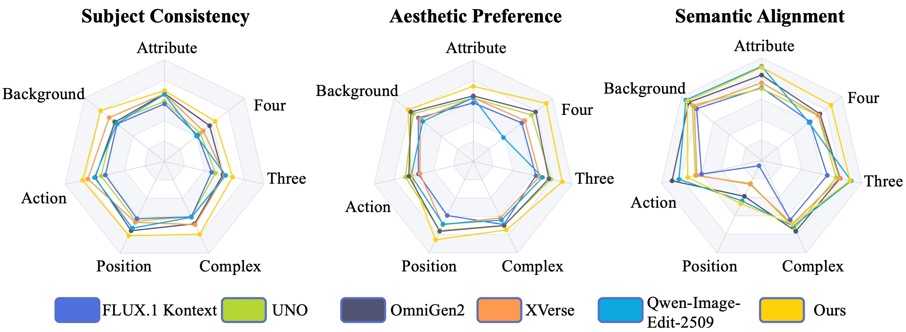
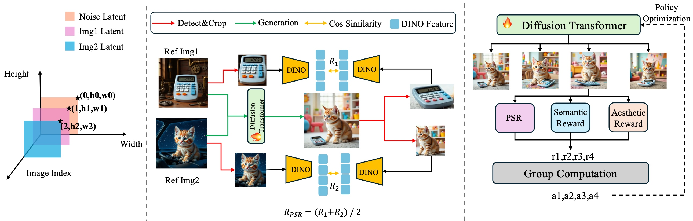
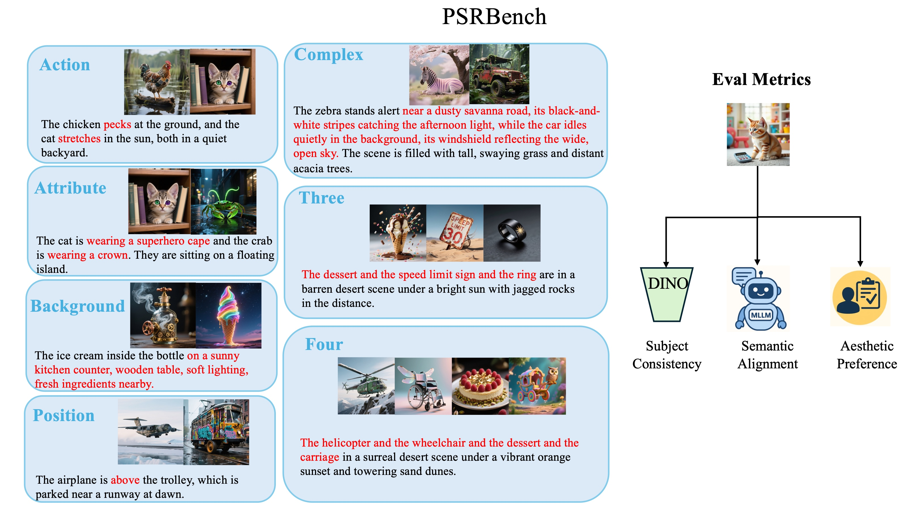
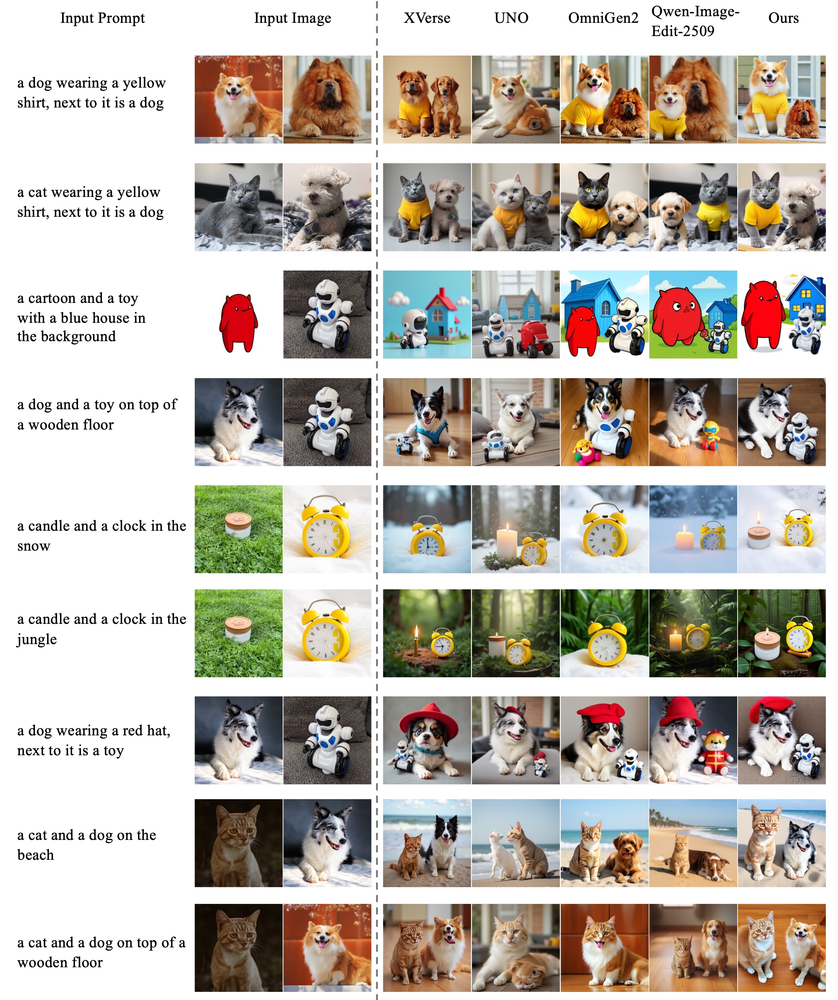

<h3 align="center">
    PSR: Scaling Multi-Subject Personalized Image Generation with Pairwise Subject-Consistency Rewards
</h3>

<p align="center"> 
<a href="https://arxiv.org/abs/2512.01236"></a>
<a href="https://drive.google.com/file/d/1p7I2E-R8q5zN8XVQwU__uKzsPai5jPWZ/view?usp=drive_link"></a>
<a href="https://github.com/wang-shulei/PSR"></a> 
</p>


<p align="center" style="font-family: 'Helvetica Neue', Helvetica, Arial, sans-serif;">
    <span>Shulei Wang</span><sup>1,2,*</sup>,
    <span>Longhui Wei</span><sup>2,†</sup>,
    <span>Xin He</span><sup>2</sup>,
    <span>Jiangbo Ouyang</span><sup>2</sup>,
    <span>Hui Lu</span><sup>2</sup>,
    <span>Zhou Zhao</span><sup>1</sup>,
    <span>Qi Tian</span><sup>2*</sup>
    <br>
    <span style="font-size: 16px;">
        <sup>1</sup> Zhejiang University &nbsp;&nbsp;
        <sup>2</sup> Huawei Inc.
    </span>
    <br>
    <span style="font-size: 14px; font-style: italic; color: #555;">
        († Corresponding author. * Work was done during internship at Huawei.)
    </span>
</p>
<p align="center">

</p>

## 📖 Introduction
Multi-subject personalized image generation remains challenging, as existing models often fail to maintain subject identity, handle complex compositions, or follow detailed text instructions. To address these issues, we introduce a scalable multi-subject data generation pipeline and a reinforcement learning framework powered by Pairwise Subject-Consistency Reward (PSR).

We further construct PSRBench, a fine-grained benchmark covering seven subsets to evaluate subject consistency, semantic alignment, and visual quality.
Our approach achieves strong improvements across all dimensions, delivering more reliable and controllable multi-subject personalized generation.
<p align="center">

</p>

## 🧪 PSRBench: Fine-grained Evaluation for Multi-Subject Personalization
Overview of PSRBench, PSRBench consists of seven subsets, each evaluating multi-subject personalized generation models from a different perspective. Each subset contains 50 high-quality test samples and is evaluated along three distinct dimensions.
<p align="center">

</p>


## 📊 PSRBench Evaluation

To evaluate your model on **PSRBench**, follow the steps below:


### **1. Download PSRBench**

You can download the full benchmark (including prompts, reference images) from the link below:

👉 **Download PSRBench**
 *https://drive.google.com/file/d/1p7I2E-R8q5zN8XVQwU__uKzsPai5jPWZ/view?usp=drive_link*

After downloading, extract the dataset and ensure the folder structure follows:

```
PSRBench/
  ├── Attribute.json
  ├── Action.json
  ├── Background.json
  ├── Position.json
  ├── Complex.json
  ├── Three.json
  ├── Four.json
  ├── subjects/
  └── animals/
  
```

------

### **2. Generate Images for Each Sample**

Then run your image generation model and save the generated image:

```
result = your_model(
    prompt=item["instruction"],
    ref_images=item["input_paths"]
)

output_path = f"outputs/{subset}/{sample_id}.png"
result.save(output_path)

# Save the output path back to the original JSON entry
item["result_path"] = output_path
```
The generated image will be stored in:

```
outputs/{subset}/{sample_id}.png
```

And the updated JSON entry (with `result_path`) can later be written to your results file for evaluation.


------


### **3. Run Evaluation**
After generation is complete, create a new environment for evaluation:
```
conda create -n PSR python=3.10
conda activate PSR
pip install -r requirements.txt
```
Install Grounding DINO:
```
pip install --no-build-isolation -e grounding_dino
```

To evaluate **Subject Consistency**, run:

```
python ./eval/subject-consistency/eval-2-subject-sc.py \
    --json_path path_to_your_result_json \
    --data_root path_data_root
```

To evaluate **Semantic Alignment**, for position subset, run:

```
python ./eval/semantic-alignmnet/postion-alignment.py \
    --json_path path_to_your_result_json \
    --data_root path_data_root
```
For other subject, you shuold first create a new environment and install sglang:

```
conda create -n sglang python=3.10.16
conda activate sglang
pip install "sglang[all]"
```
Then launch a server
```
python -m sglang.launch_server --model-path Qwen/Qwen2.5-VL-32B-Instruct --api-key psr --port 17140 --chat-template qwen2-vl --enable-p2p-check --mem-fraction-static 0.85
```
Then you can run evaluation scripts
```
python ./eval/semantic-alignmnet/postion-alignment.py \
    --json_path path_to_your_result_json \
    --data_root path_data_root
```

To evaluate **Aesthetic Preference**, follow the HPSv3 scripts from
https://github.com/MizzenAI/HPSv3


## 🖼️ Visualizations
Visualization results on PSRBench
<p align="center">

</p>
Visualization results on DreamBench
<p align="center">

</p>

<!-- ## 📘 Citation 
If you find PSR helpful in your research or applications, please consider starring the project ⭐ and citing it using the following BibTeX entry.

```
TBD -->
```
